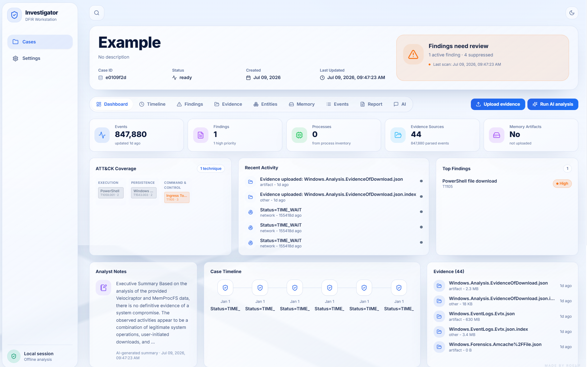
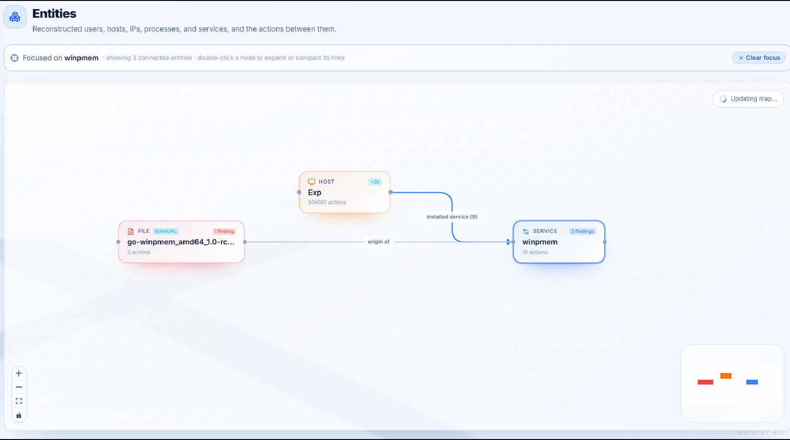
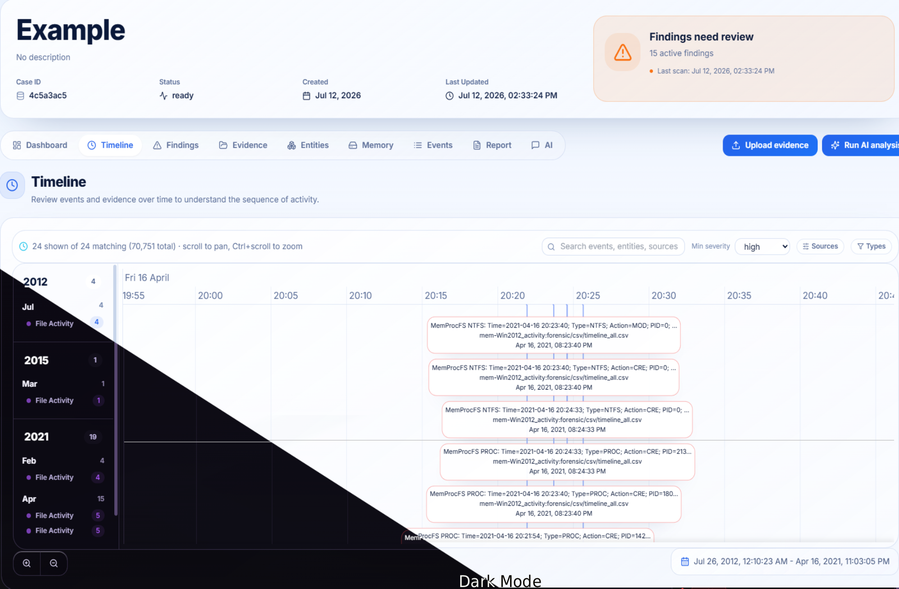
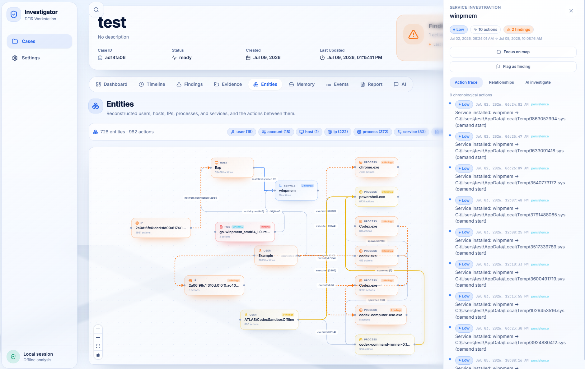

# Investigator — Velociraptor & Memory Forensics GUI (with AI support)

**Made by Roei.f**

A fully local DFIR workstation. Ingest Velociraptor collections (events & artifacts) and raw memory dumps, run MemProcFS + YARA + a deterministic detection engine, and let a configurable LLM (local Ollama, or remote OpenAI / Anthropic / Gemini) reconstruct the machine's story — a full timeline, interactive process and entity maps, MITRE ATT&CK coverage, and a written incident summary.

Everything runs on your machine. API keys are stored in your OS credential vault, never on disk in plaintext.

<p align="center">
  
</p>

## Table of contents

- [Features](#features)
- [Quick start](#quick-start)
- [Configure the AI](#configure-the-ai)
- [Working a case](#working-a-case)
- [How analysis works](#how-analysis-works)
- [Requirements](#requirements)
- [Architecture](#architecture)
- [Development](#development)
- [Dependency security](#dependency-security)
- [A note on detections](#a-note-on-detections)

## Features

- **Bring your own AI.** Ollama (on-device) with live model discovery, or OpenAI, Anthropic, and Google Gemini with per-provider model catalogs and a built-in connection tester.
- **Velociraptor ingestion.** Offline-collector ZIPs, JSON/JSONL artifact results, CSV, and EVTX are parsed and normalized into a unified event model with full-text search. Events and logs can also be fed in manually.
- **Memory forensics.** MemProcFS process, module, VAD, thread, handle, network, service, and driver maps feed deterministic injection, hollowing, suspicious-service, network, and driver heuristics. Executable private-memory candidates are checked against VAD shape, module load order, live thread start addresses, network context, and machine-wide prevalence before escalation.
- **APT hunting.** YARA sweep of memory using a bundled C2 / offensive-tooling ruleset (Cobalt Strike, Meterpreter, Sliver/Covenant/Havoc, Mimikatz, Rubeus, reflective loaders, shellcode markers) plus your own rules directory.
- **Deterministic detection engine.** LOLBins, suspicious parent/child chains, masquerading, execution from staging directories, persistence, log clearing, and C2 beaconing — every finding mapped to MITRE ATT&CK before the LLM ever runs.
- **AI orchestration.** Map-reduce analysis over the evidence produces an executive summary, a timeline narrative, and per-finding verdicts. During correlation, verdicts, and chat, the model can query the case database itself (full-text event search, process trees, memory correlation data, findings, aggregates) through a provider-agnostic tool loop — it pulls the actual log lines behind a claim before committing to it. A retrieval-augmented chat answers questions from the case's own data and keeps a compact rolling memo of long conversations, so context truncation doesn't lose the investigation thread.
- **Analyst workstation UI.** Responsive glass-panel workspace with system-aware light/dark themes, a persistent case shell, expandable current-case event search, reusable detail drawers, subtle loading/interaction animation, and case-scoped busy states.
- **Investigation views.** A server-filtered chronological timeline, deterministic layered entity map, overview dashboard, memory explorer, findings and event tables, evidence management, report export, and streaming AI chat. Timeline and entity-map bundles load only when those routes are opened.
- **Analyst findings.** Events and entities can be promoted to durable manual findings. Event flags carry their chosen severity into the referenced event and exact-entity-related timeline activity, while benign/delete actions restore the prior parser or detector severity.

| Entity map | Timeline |
| --- | --- |
|  |  |

## Quick start

```bash
# From the project root
python run.py
```

On Windows you can also just double-click **`run.bat`** (it calls `run.py`).

This creates the Python virtual environment, installs locked dependencies, builds the frontend, and opens the app at `http://localhost:8400`.

Options:

```bash
python run.py --dev                  # backend + Vite dev server with hot reload (frontend on :5173)
python run.py --port 9000            # use a different port
python run.py --skip-build           # skip rebuilding the frontend
python run.py --allow-unlocked-deps  # temporary local fallback if Python lock files aren't generated yet
```

<details>
<summary><strong>Manual start</strong> (without the launcher)</summary>

```powershell
cd backend
python -m venv .venv
.\.venv\Scripts\python.exe -m pip install --require-hashes -r requirements-memory.lock
.\.venv\Scripts\python.exe -m app.main   # serves API on :8400 (and the built UI if present)

# in another terminal, for UI development:
cd frontend
npm ci
npm run dev                               # http://localhost:5173, proxies /api to :8400
```

</details>

## Configure the AI

Open **Settings**:

- **Ollama (local):** point at your Ollama server URL (default `http://localhost:11434`); the model dropdown is populated live from your installed models.
- **OpenAI / Anthropic / Gemini:** paste your API key (stored in the OS keyring), click **Test**, then pick a model.

With Ollama, no case data ever leaves your machine. With a remote provider, only the evidence excerpts included in prompts are sent to that provider.

## Working a case

1. **Create a case.**
2. **Upload evidence** — drop a Velociraptor collection (ZIP / JSON / JSONL / CSV / EVTX) or a memory dump (`.raw`, `.dmp`, `.mem`, `.vmem`, `.lime`, ...). Ingestion, detection, and memory analysis run automatically with live progress.
3. **Run AI analysis** — correlates everything into a report, timeline narrative, and per-finding verdicts.
4. **Explore** the **Overview**, **Timeline**, **Entity Map**, **Memory**, **Findings**, and **Events** tabs, export the **Report**, or interrogate the case in **AI Chat**.

The magnifying-glass control in the workspace header expands into a current-case event search. Results stay in place under the field; double-click a result to open its full raw event drawer. Timeline events also open on double-click. In Entity Map, a single click opens the entity dossier, while double-click expands or compacts one-hop relationships in focus mode.

Manual findings are analyst intent, not destructive edits to source evidence. The app stores the finding and the event's previous severity separately. Removing the finding or marking it benign restores the previous severity; detection rebuilds restore their baseline first and then reapply active manual findings.

Cases and configuration live under `~/.investigator/` — one self-contained SQLite database per case.

## How analysis works

Investigator is built around **correlation-first analysis**. Raw evidence is normalized into common tables for events, processes, memory findings, detections, entities, and report evidence. The deterministic engine then links those records by time, process identity, command line, file path, network endpoint, user, service name, registry key, memory session, and MITRE ATT&CK technique.

<p align="center">
  
</p>

Correlation exists to reduce noisy one-off alerts:

- A single suspicious command, YARA match, handle, network connection, or memory anomaly is treated as a **lead**, not a verdict.
- Confidence increases when **independent sources agree** — a process tree plus a Sysmon event, a memory VAD plus a thread start address, a YARA match plus extracted process/module details, or persistence plus later execution.
- Benign developer and forensic tooling stays low-confidence or contextual unless there is stronger evidence of compromise.

The LLM layer runs **after** deterministic parsing and detection. It receives normalized findings, source events, memory context, process trees, entity relationships, and database search tools; during report generation and chat it can query the case database for supporting rows before writing conclusions. Reports are intentionally cautious: each finding describes what was observed, what it may indicate, what evidence supports it, and what follow-up would confirm or dismiss it. Always take AI verdicts and output with a grain of salt.

Memory correlation combines MemProcFS process, module, VAD, thread, handle, service, driver, network, forensic CSV, event log, and YARA outputs. Where possible, memory findings are attached back to concrete entities — a process, module, file, service, registry item, command line, or connection. If the source can't be confidently resolved, Investigator keeps the finding as a standalone memory result instead of inventing a relationship.

## Requirements

- **Python 3.11+**
- **Node.js 18+**
- Optional but recommended: `memprocfs` and `yara-python` (installed via `backend/requirements-memory.lock`). Without them, Velociraptor artifact analysis still works; raw memory-dump parsing and YARA scanning are skipped and reported in the UI health status.

## Architecture

**→ Full architecture guide: [docs/ARCHITECTURE.md](docs/ARCHITECTURE.md)** — system diagrams, the evidence lifecycle, module-by-module breakdown, data model, API surface, and security model.

The short version:

- **Backend** (`backend/app`): FastAPI + SQLAlchemy, one SQLite database per case with FTS5 search. A per-case async operation coordinator serializes ingestion, analysis, detection rebuilds, and deletion; a per-database writer gate serializes SQLite write transactions while WAL keeps reads available. CPU/blocking graph and dossier work is moved off the event loop.
- **Frontend** (`frontend/src`): React + TypeScript + Vite + Tailwind, with tokenized light/dark themes, React Flow, vis-timeline, Recharts, and TanStack Query. Query keys and transient UI state are case-scoped, long operations remain visible through WebSockets, and heavy visualization routes are code-split.

## Development

```bash
# Backend tests
cd backend
python -m venv .venv && .venv/bin/pip install --require-hashes -r requirements-dev.lock
.venv/bin/python -m unittest discover -s tests

# Frontend with hot reload (backend must be running)
cd frontend
npm ci
npm run dev
```

CI runs the backend lint + test suite (Ruff, `unittest`, `pip-audit`) and the frontend type-check + build on every push and pull request. See [SECURITY.md](SECURITY.md) for the vulnerability-reporting policy.

## Dependency security

Investigator installs reproducible dependencies from lock files, not floating package ranges. Human-edited Python dependencies live in:

- `backend/requirements.in` — core backend
- `backend/requirements-memory.in` — MemProcFS and YARA memory-forensics extras
- `backend/requirements-dev.in` — development and CI tools

Regenerate and commit the hashed locks after changing any dependency:

```powershell
cd backend
python -m pip install uv
.\scripts\update-locks.ps1    # or ./scripts/update-locks.sh
```

The launcher installs from `backend/requirements-memory.lock` with `pip --require-hashes` and re-runs the install only when that lock file changes. The frontend uses the committed `frontend/package-lock.json` and installs with `npm ci`.

Use `python run.py --allow-unlocked-deps` only as a temporary local workaround while creating the first lock files — never for releases or normal installs.

## A note on detections

The deterministic engine and bundled YARA rules are heuristic, tuned to surface candidate activity for analyst review. Treat AI output as an assistive lead, not ground truth — always confirm against the raw evidence, which is one click away throughout the UI.

## Credits

Investigator DFIR is made by **Roei.f**.
