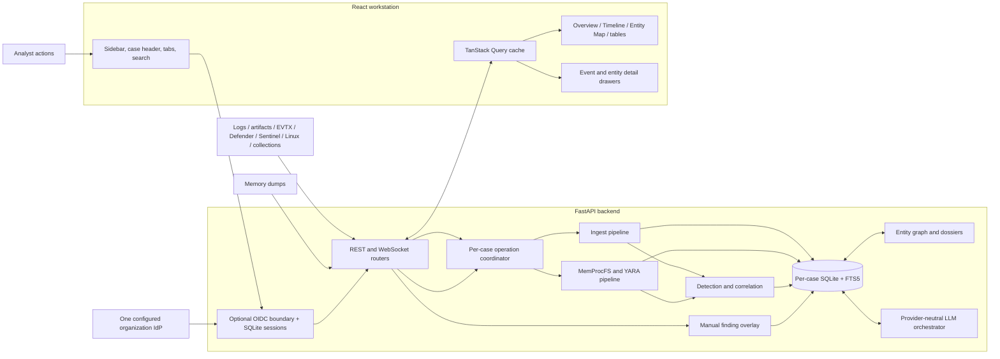
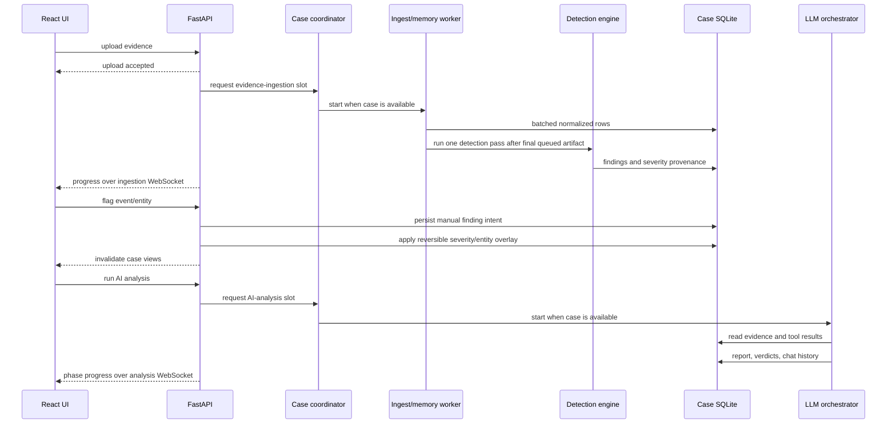

# Investigator Architecture

This document describes the current Investigator architecture: runtime ownership,
evidence flow, UI composition, concurrency rules, storage semantics, visualization
pipelines, and the invariants contributors must preserve. Installation and daily
usage are covered in the [README](../README.md); security reporting is covered in
[SECURITY.md](../SECURITY.md).

## Contents

- [Architecture goals](#architecture-goals)
- [Migration summary](#migration-summary)
- [System overview](#system-overview)
- [Repository layout](#repository-layout)
- [Evidence and analysis lifecycle](#evidence-and-analysis-lifecycle)
- [Backend architecture](#backend-architecture)
  - [Serving model](#serving-model)
  - [Case registry and storage](#case-registry-and-storage)
  - [SQLite concurrency](#sqlite-concurrency)
  - [Long-running operation coordination](#long-running-operation-coordination)
  - [Ingestion and memory analysis](#ingestion-and-memory-analysis)
  - [Detection and analyst findings](#detection-and-analyst-findings)
  - [Global rule management](#global-rule-management)
  - [Entity graph and dossiers](#entity-graph-and-dossiers)
  - [AI orchestration](#ai-orchestration)
  - [API and WebSockets](#api-and-websockets)
- [Frontend architecture](#frontend-architecture)
  - [Application shell and routing](#application-shell-and-routing)
  - [Theme and design tokens](#theme-and-design-tokens)
  - [Data and state boundaries](#data-and-state-boundaries)
  - [Timeline rendering pipeline](#timeline-rendering-pipeline)
  - [Entity Map rendering pipeline](#entity-map-rendering-pipeline)
  - [Drawers, modals, and interaction contracts](#drawers-modals-and-interaction-contracts)
  - [Asynchronous UX and performance](#asynchronous-ux-and-performance)
- [Data model](#data-model)
- [Consistency and security invariants](#consistency-and-security-invariants)
- [Testing and change checklist](#testing-and-change-checklist)

## Architecture goals

Investigator is a local-first DFIR workstation. Its architecture follows these
principles:

1. **Deterministic evidence first.** Parsing, normalization, memory analysis,
   detection, correlation, and analyst overrides produce inspectable database
   state. AI is downstream and advisory.
2. **One case, one database.** Each case owns a SQLite database and evidence
   directory. Queries, caches, background jobs, and transient frontend state are
   keyed by case ID.
3. **Readable during work.** Long writes are serialized, but SQLite WAL permits
   concurrent readers. The UI shows busy state and progress instead of freezing.
4. **Analyst intent is reversible.** Marking an event or entity as a finding does
   not destroy parser/detector provenance. Prior event severity is restored when
   the manual finding is removed or suppressed.
5. **Visualizations are derived views.** Timeline and Entity Map are built from
   normalized rows and can be rebuilt without changing source evidence.
6. **Exact identity beats convenient matching.** Full file/process paths are
   normalized and matched exactly. Basename fallback is used only when the source
   identity is basename-only and unambiguous.
7. **Static Reverse isolation.** Reverse workspaces have a separate versioned
   SQLite store. Untrusted artifacts enter only a non-root, no-network Docker
   sandbox through generated UUID paths and a shared argv/file-operation policy;
   uploaded samples are not executed.

## Migration summary

The current architecture replaces the earlier UI/runtime behavior while preserving
case route paths and the per-case database model.

| Earlier behavior | Current architecture |
| --- | --- |
| Header-centered navigation and a separate Dashboard entry | Persistent responsive sidebar plus case-scoped Dashboard/overview and segmented case tabs |
| Dark-only visual assumptions | Semantic CSS tokens with persisted system/light/dark theme selection |
| Search occupied permanent header space or navigated away | Expandable current-case search with inline results and double-click detail drawer |
| Visualization dependencies in the initial bundle | Timeline and Entity Map loaded as lazy route chunks |
| Timeline exposed intermediate vis-timeline geometry | Timeline stays hidden until its imperative layout reports ready |
| Timeline filters and facets shared one query lifecycle | Stable case-wide facet query plus abortable server-filtered event query |
| Entity nodes stacked in fixed columns | Deterministic semantic layers with severity ranking and barycenter crossing reduction |
| Entity click mixed selection and expansion | Single-click dossier; explicit Focus action; double-click one-hop expand/compact |
| Background workflows could overlap by case | Per-case async coordinator for ingestion, analysis, rebuild, and deletion |
| SQLite busy timeout was the main writer protection | WAL plus a process-local per-database writer transaction gate |
| Manual findings existed mainly as finding rows | Durable analyst intent with node derivation, exact-path correlation, and reversible event severity |
| Entity dossier construction could block an async WebSocket | Synchronous graph/dossier work dispatched through `asyncio.to_thread()` |
| Previous query data could briefly cross case routes | Query placeholders and transient UI state explicitly constrained by case ID |

## System overview



The production frontend is built into `frontend/dist` and served by FastAPI, so
the normal deployment is one local process on `127.0.0.1:8400`. Development mode
uses Vite on `:5173` with `/api` proxied to the backend.

### Optional organization SSO

When enabled with environment variables, ASGI middleware authenticates every API
and WebSocket scope before route code runs. Health and auth bootstrap/login/
callback endpoints remain anonymous so the SPA can render a login or
configuration error; static assets remain public. OIDC discovery, authorization
code exchange, and ID-token signature/issuer/audience/time checks use Authlib and
an explicit asymmetric algorithm allowlist. State, nonce, and PKCE verifier are
one-time SQLite transactions. Successful identities are reduced to a subject,
display name/email, and admin bit; full claims and tokens are not persisted.

Session cookies are opaque random values whose SHA-256 hashes are stored in
`~/.investigator/auth.db`, with idle and absolute expiry and logout revocation.
The exact configured public origin drives callback, CORS, Host, HTTP Origin, and
WebSocket Origin policy; forwarded headers are never trusted. Group/role claims
are compared case-sensitively against one deployment allowlist. Entra
`hasgroups`/`_claim_names` overage indicators fail closed rather than invoking
Graph. SSO is intentionally one IdP and one shared pool of cases/rules/Reverse
projects; it is not a multi-tenant authorization model.

### Reverse workspaces

Reverse is a native top-level module, not a second web service. Metadata is kept
in `~/.investigator/reverse/reverse.db`; each project owns UUID-addressed upload,
output, log, and staging directories. A nullable case ID provides an optional
association without crossing SQLite foreign-key boundaries. Deleting a case
clears that association and records an audit event but preserves Reverse work.

Each analysis run snapshots the shared Investigator provider/model settings and
the sandbox image digest/tool versions. The orchestration is an adaptive
prompt-and-tool loop: one `run_cmd`, `read_file`, `write_file`,
or `list_dir` operation per turn, optional completion/checkpoint signals, exact
duplicate suppression, and an evidence-aware progress controller. The controller
persists semantic method/target keys, normalized failure fingerprints, output
novelty, and diagnostic state. A repeated failure or three no-evidence operations
requires an independent invariant check before the same semantic method can run
again. Host and container share the same
argv/executable/path policy. Containers have no network or host
mounts, run as a non-root user with all capabilities dropped, use a read-only root
filesystem and bounded tmpfs, and are destroyed after the configured idle TTL.
Artifacts are streamed into tmpfs through a fixed staging broker with UUID,
offset, size, and SHA-256 checks; no project directory is mounted into Docker.
The model may use `write_file` to create a Python parser/decoder below output or
tools and invoke it through `run_cmd` with `python3`. The broker routes Python
through a fixed audited runner that denies networking, child processes, native
loading, root-filesystem access, and sample mutation.
The fixed `pyinstaller-inspect` tool derives CArchive offsets from the cookie end,
validates package/TOC/entry bounds and compression headers, reports embedded-versus-
runtime Python compatibility, and can disassemble selected raw marshalled code with
`xdis`. Its extraction output remains restricted to `/workspace/output`.

Follow-up Reverse chat uses a 12-turn analyst loop and the same four
operations, command policy, duplicate suppression, and evidence feedback. A chat
answer can therefore inspect the sealed sample or create a bounded helper instead
of relying only on the previously generated report.

There is no host checklist, artifact-specific completion gate, completion-marker
requirement, or report-format gate. Each run persists objectives, supported
findings, unresolved work, next steps, and the latest substantive draft. Turn
extensions resume that state; declining an extension publishes the strongest
saved draft as partial or blocked instead of replacing it with a limitations-only
fallback. Manual Stop remains resumable.
An `ANALYSIS CHECKPOINT` is persisted separately from the publication draft and
returns to the tool loop, preventing useful interim prose from triggering an early
review cycle.
An analyst can also continue a completed partial, blocked, or warning-bearing run.
The operation preserves the current report as a content-addressed output artifact,
keeps it readable and signed during the resumed tool loop, and only replaces the
published report when new bytes have completed review and signing.

Finalization extracts structured IOCs and gives a goal-driven reviewer the full
compact tool chronology, objective coverage, cited output, and relevant failure
evidence. The reviewer chooses publish, report-only revision, or targeted
continued analysis. Review is capped at two passes, and its passed,
passed-with-warnings, or failed result is independent from the complete, partial,
or blocked analysis outcome. Material claims use stable `[trace:<message-id>]`
references that resolve through a project-scoped evidence API. Exact UTF-8 report
bytes are atomically committed and signed regardless of outcome or remaining
review warnings. A later revision invalidates the prior signature state and signs
the revised bytes; signing failures remain retryable without rerunning analysis.

## Repository layout

```text
Investigator/
|-- run.py                         launcher and dependency/build orchestration
|-- run.bat                        Windows launcher wrapper
|-- README.md                      user and contributor entry point
|-- SECURITY.md                    security and sensitive-data policy
|-- docs/
|   `-- ARCHITECTURE.md            this document
|-- backend/
|   |-- app/
|   |   |-- main.py                FastAPI setup and static SPA serving
|   |   |-- api/                   REST and WebSocket routers
|   |   |-- ingest/                parsers, normalization, evidence lifecycle
|   |   |-- memory/                MemProcFS, YARA, forensic extraction
|   |   |-- detect/                rules, overrides, manual findings, graphs
|   |   |-- rules/                 rule catalog, global state, Sigma compiler
|   |   |-- llm/                   providers, tools, prompts, orchestration
|   |   |-- reverse/               projects, analysis, sandbox policy, provenance
|   |   |-- store/                 registry, operation locks, SQLAlchemy storage
|   |   `-- models/                request/response schemas
|   `-- tests/                     unittest regression suite
|-- backend/reverse_sandbox/       pinned optional static-analysis image source
`-- frontend/
    |-- src/
    |   |-- App.tsx                global workstation shell and case search
    |   |-- main.tsx               router, query client, lazy route boundaries
    |   |-- index.css              theme tokens and shared visual behavior
    |   |-- components/            panels, drawers, upload, analysis, flagging
    |   |-- lib/                   API client, types, theme provider, UI helpers
    |   `-- pages/                 case and settings routes
    `-- dist/                      production build served by FastAPI
```

## Evidence and analysis lifecycle



Important lifecycle behavior:

- Ingestion and memory analysis run outside the request/response lifetime.
- The operation coordinator queues mutually exclusive work for the same case.
- Artifact ingestions remember whether any queued file added events. Detection is
  deferred while more files are queued and runs once after the last file. An isolated
  zero-event upload skips detection.
- After a queued job acquires its slot, it rechecks that the case still exists.
  This prevents a delayed job from recreating a deleted case database.
- Upload and analysis progress are pushed to the UI. Completion invalidates all
  case-scoped views that can be affected by newly derived data.
- The case remains readable during long operations. Editing controls that would
  conflict with the current operation are disabled or queued with visible state.
- On backend startup, persisted `ingesting`/`analyzing` states are recovered to
  `ready` because their process-local jobs cannot have survived the restart.

## Backend architecture

### Serving model

`backend/app/main.py` owns the FastAPI application:

- binds to loopback by default;
- rejects requests whose `Host` header is not a loopback name via
  `TrustedHostMiddleware` (see network controls below);
- restricts CORS to the application and Vite development origins;
- serves `frontend/dist` with an SPA fallback when a production build exists;
- exposes health information for optional memory/YARA capabilities;
- maps `CaseNotFoundError` to a `404` so a request for an unregistered case
  never surfaces as a `500`;
- recovers interrupted transient case states and cleans stale/orphaned artifacts; and
- disposes cached SQLAlchemy engines at shutdown.

Blocking or CPU-heavy work must not execute directly on the asyncio event loop.
The ingest and analysis pipelines use executors/threads, and entity dossier
construction invoked from an async WebSocket uses `asyncio.to_thread()`.

#### Network controls

`app/api/security.py` centralizes the request-origin controls for this
loopback-only backend. Binding to `127.0.0.1` alone does not stop a hostile web
page — or a DNS-rebinding attack — from reaching the backend through the user's
own browser, and CORS does not apply to WebSocket handshakes. The module defines:

- `ALLOWED_HOSTS` (`localhost`, `127.0.0.1`) — the loopback names the server
  answers to. `TrustedHostMiddleware` compares the `Host` header (port stripped)
  against this list, so a rebound `attacker.example` resolving to `127.0.0.1` is
  refused. **If the backend is ever bound to a non-loopback hostname, add that
  hostname here and to `allowed_origins()`; the two lists must stay aligned.**
- `allowed_origins()` — the browser origins permitted for CORS *and* WebSocket
  handshakes (the built app on `INVESTIGATOR_PORT` and the Vite dev server on
  `:5173`), derived from `INVESTIGATOR_PORT` so a custom `--port` is covered.
- `authorize_ws(websocket, case_id)` — used by every WebSocket route before
  `accept()`. It refuses a handshake whose browser `Origin` is present but not in
  `allowed_origins()` (a missing `Origin` denotes a non-browser client and is not
  a cross-site vector) and refuses unknown cases, closing before the handshake
  completes.

### Case registry and storage

`app/store/cases.py` owns the registry and case lifecycle. The registry is a JSON
document under `~/.investigator/cases/registry.json` containing display metadata,
status, timestamps, and case IDs. Case IDs are validated before filesystem access.

Each case directory contains:

```text
~/.investigator/cases/<case_id>/
|-- case.db                         SQLAlchemy/SQLite database
|-- case.db-wal / case.db-shm       SQLite WAL state while active
|-- uploads/                        original uploaded evidence
`-- derived/memprocfs/<dump>/       manifests, forensic output, and extracted files
```

Registry writes are serialized and persisted atomically. Deletion disposes the
cached database engine before removing the directory. Registry membership is
enforced at a single chokepoint: `get_session()` raises `CaseNotFoundError`
(mapped to `404`) for any id absent from the registry, *before* the case
directory or database file is materialized. This prevents a crafted or stale id
(for example a well-formed but unknown `deadbeef`) from creating orphan case
state through any route, rather than relying on each route to check first.
Queued background jobs additionally recheck membership after acquiring their
operation slot, so a delayed job cannot recreate a deleted case.

### SQLite concurrency

SQLite supports concurrent readers in WAL mode but only one writer. Investigator
uses two complementary controls in `app/store/database.py`:

1. **SQLite configuration:** WAL journaling, a 30-second busy timeout, page cache,
   in-memory temporary storage, and mmap for read-heavy queries.
2. **Per-database writer gate:** every session is a `SerializedWriteSession` with
   an `RLock` shared by all sessions for that database path. It acquires the lock
   before the first flush/DML statement and holds it through commit, rollback, or
   close.

Read-modify-write metadata operations must call
`acquire_session_write_lock(session)` *before the read*. Locking only at flush is
too late for JSON metadata such as manual findings and benign/disabled-rule sets:
two sessions could both read the old value and one update would be lost even if
SQLite never raised `database is locked`.

The writer gate is process-local. Investigator is designed to run as one backend
process; launching multiple independent backend processes against the same case
directory is not a supported deployment model.

### Long-running operation coordination

`app/store/operations.py` provides a `CaseOperationCoordinator` keyed by case ID.
It serializes operations whose side effects must not overlap:

- evidence ingestion and memory analysis;
- AI analysis;
- detection rebuilds; and
- case deletion.

The coordinator tracks the active operation and queue depth for status messages.
The ingestion manager additionally tracks a per-case pending-detection marker so a
batch of separately uploaded files does not rerun whole-case detection for every file.
It is an asyncio coordination layer, distinct from the SQLite writer gate:

- the coordinator protects high-level workflows and filesystem/database lifetime;
- the writer gate protects individual database transactions; and
- WAL preserves read availability while a writer is active.

Do not replace one layer with the other. A workflow may perform several commits,
touch uploaded files, or invoke external tools, while a transaction lock covers
only one database transaction.

### Ingestion and memory analysis

`app/ingest` accepts ZIP collections (e.g. Velociraptor), JSON, JSONL, CSV, EVTX/event
logs, Linux syslog/auditd/journald evidence, and Microsoft Defender / Azure (Sentinel)
log exports.

- `parsers.py` streams source rows, flattens Log Analytics columnar envelopes, and
  preserves ZIP member timestamps used by year-less RFC3164 records.
- `normalize.py` maps source-specific fields into the shared `Event` schema.
- `linux.py` parses RFC3164/RFC5424/ISO syslog, merges auditd records by audit id,
  reconstructs `EXECVE` command lines, and normalizes journald JSON rows.
- `sentinel.py` maps `SecurityEvent`, `Syslog`, `SigninLogs`, and `AuditLogs`; Windows
  SecurityEvent rows reuse the EVTX EventID classifier and Sentinel Syslog rows reuse
  the Linux message classifier.
- `pipeline.py` batches event inserts, synchronizes FTS rows, extracts process
  inventory where available, reports progress, coalesces queued artifact detection
  work, and skips redundant detection for zero-event uploads.
- `evidence.py` owns uploaded-file listing, deletion, and re-ingestion semantics.

Uploads and archive expansion are bounded so a single file, a runaway case, or a
ZIP bomb cannot exhaust local disk. The upload routes enforce a per-file cap and
a per-case total cap (`INVESTIGATOR_MAX_UPLOAD_BYTES` / `INVESTIGATOR_MAX_CASE_BYTES`,
generous defaults because memory dumps are legitimately large) and validate chunk
ordering for resumable uploads. `iter_zip_members` caps the parsable-member count,
the per-member and total expanded size, and rejects members whose real
expanded/compressed ratio looks like a decompression bomb — the write loop is
authoritative, since declared central-directory sizes are attacker-controlled.

Format routing follows content before filename hints. Journald field signatures are
checked before Sentinel source-name inference, and pretty-printed JSON objects are
distinguished from JSONL by whether the first physical line is a complete object.
Log Analytics envelope recognition therefore does not depend on JSON property order.

Memory images route through `app/memory`:

- MemProcFS collection provides process/module/VAD/thread/handle/network/service
  and driver views;
- forensic CSV and EVTX outputs are normalized into the same `events` table;
- YARA scans bundled and optional user rules; and
- correlation requires multiple independent artifacts before escalation where
  possible, reducing machine-wide or tooling-related noise.

### Detection and analyst findings

`app/detect/engine.py` runs deterministic rules and stores both conclusions and
provenance. Event severity is accompanied by `severity_reason`, allowing every
timeline/detail surface to explain whether severity came from parsing, a detection,
context, flagged-entity propagation, or analyst action.

Linux/Entra authentication correlation is keyed by protocol, source address, and
account. Failure trackers retain both the earliest and latest timestamp; a success is
classified as post-brute-force only when it occurs at or after the latest observed
failure. Linux account-management and persistence events share stable normalized raw
fields regardless of whether they came from syslog, auditd, journald, or Sentinel.

`app/detect/overrides.py` persists disabled rules and benign finding identities in
`case_meta`. These overrides survive a findings-table rebuild and are applied after
detector output is materialized.

### Global rule management

`app/rules/` manages detection rules application-wide, separately from the per-case
overrides above.

`registry.py` reads the rule tables in `app/detect/rules.py` and presents them as one
catalog of addressable rules. It holds references to the already-compiled patterns
and compiles nothing. Rules are grouped by the slug of their description, because
several tables carry more than one pattern under a single description and the
per-case override system already treats those as one rule. Each entry also records
the legacy id `overrides.rule_id_for()` derives from the finding title, which is what
existing cases have persisted. Tables whose members all collapse to one legacy id —
LOLBins, parent/child pairs, masquerade paths, execution directories — expose a
family switch plus per-member rules, so a member can be toggled individually while an
existing per-case disable of the family id keeps working.

`profile.py` snapshots the active rule set once per detection run. With no
customization it returns the module tables themselves, by identity, so behavior and
memory are unchanged and the run costs one extra `stat`. Filtering only ever removes
entries, which is why the literal command-line prefilters remain valid superset gates
and are left untouched. Global state is also applied centrally in `_add_finding`,
which is the only place that sees every finding and therefore the only way to cover
detections written as imperative engine code; a shared legacy id is suppressed there
only once every rule that can emit it is disabled.

`sigma_compile.py` parses analyst rules with pySigma and compiles the condition tree
into nested closures. pySigma is required for **custom** rules only: the catalog, the
enable/disable state, the severity overrides, and the profile the engine runs are plain
Python. The import is guarded, so an installation without the package still starts, still
manages every built-in rule, and still runs detections — it reports `sigma: false` from
`/api/health`, refuses rule authoring with `503`, and says so on the Rules page. This
matters because `app/main.py` imports the rules router at module scope, so an unguarded
dependency there would stop the whole workstation, not just one feature. There is no `eval`, no `exec`, and no generated source. pySigma
resolves value modifiers before compilation, so `contains`, `all`, `base64offset` and
`windash` arrive as ordinary string or expansion values. Constructs this build cannot
execute are refused by name at save time rather than stored as a rule that silently
never matches. Compilation also derives the literal strings a subject must contain
for the rule to have any chance of matching; those become a prefilter gate, and a
rule with no derivable literal is counted against a hard cap because it must be
evaluated against every process and event.

`safe_regex.py` bounds analyst-supplied regular expressions. The verdict is measured
against adversarial subjects derived from the pattern itself rather than inferred
syntactically, so ordinary patterns pass while catastrophically backtracking ones are
rejected, and matching is capped by subject length.

The two mechanisms are deliberately different, and the distinction is what the Rules
page communicates: a globally disabled rule is removed before the run and produces
nothing, while a per-case disabled rule still produces its finding and demotes it to
`info` reversibly.

`app/detect/manual.py` implements durable analyst-created findings:

- intent is stored as JSON in `case_meta`, then materialized as `Finding` rows;
- entity flags carry explicit type/value information;
- event flags derive an entity from raw evidence, including EvidenceOfDownload
  `DownloadedFilePath`, common file/process fields, host, user, and IP fields;
- Windows device prefixes such as `\\.\C:\...` are normalized;
- the referenced event and events mentioning the same exact full path/entity can
  inherit the manual severity;
- prior event severity and reason are stored separately as a reversible baseline;
- benign/delete restores the baseline, while restore/un-benign reapplies intent;
- a detection rebuild restores manual baselines before recalculation and reapplies
  active manual findings afterward; and
- legacy findings without derived node metadata are repaired lazily when Events,
  Timeline, or Entity Map next reads the case.

Full paths never correlate solely because another path shares the same basename.
When only a basename is available, fallback is allowed only for an unambiguous
same-type node. This identity rule is shared by event impact and graph correlation.

### Entity graph and dossiers

`app/detect/entity_graph.py` derives a graph from Events, Processes, and Findings,
including process/event rows normalized from memory artifacts. Node types include
user, account, host, IP, process, service, file, URL, registry, and domain. Edges
record an action verb, count, severity, timestamps, and representative samples.

Graph construction behavior:

- event actors are extracted through shared source-field mappings;
- manual-node event candidates are indexed in one pass rather than scanning the
  complete event list once per manual finding;
- full-path process/file identity uses normalized exact matching;
- high-risk edges can be animated by the frontend, but animation is presentation
  only and does not change graph data;
- graph results are cached by case/query parameters and a case DB/WAL fingerprint;
- builds for one case are serialized to avoid duplicate expensive work; and
- `max_nodes` caps the response while preserving severity/activity ranking.

An entity dossier rebuilds the relevant graph context and returns chronological
actions, neighbors, findings, and metadata. AI entity investigation uses this
dossier and runs its synchronous construction off the asyncio event loop.

### AI orchestration

`app/llm` is provider-neutral. Ollama stays local; OpenAI, OpenRouter, Anthropic, and Gemini
send only prompt/tool excerpts to the configured provider. The Gemini provider
uses the maintained `google-genai` client (not the legacy `google-generativeai`
package). API keys live in the OS credential vault, and the settings UI warns that
evidence leaves the machine whenever a remote provider is selected.

The tool loop exposes bounded database operations such as event search/filtering,
counts, process lookup, memory results, findings, and a compact download inventory
that merges event provenance with correlated finding evidence. Executables and
archives are prioritized before high-volume browser assets, and filename filtering
is available when the analyst asks about one file. `analyze_case()` performs a
map/reduce-style workflow over event categories, deterministic findings, and memory
signals, then writes a report, timeline narrative, and finding verdicts.

Two safety rules constrain automated analysis. First, it is **read-only with
respect to analyst conclusions**: the correlation tool loop runs with
`allow_suppression=False`, so a prompt injection embedded in attacker-controlled
evidence cannot cause the model to bury a legitimate finding. The model may
*propose* suppression in its narrative; only an analyst applies one, through the
UI benign toggle or an explicit chat request. Second, an **empty case is never
reported clean**: with no events, processes, or memory results, `analyze_case()`
short-circuits without calling the model and writes a "Not assessed — no evidence
analyzed" report, because absence of findings there reflects absence of data, not
a safe host.

Chat and entity investigation stream over WebSockets. Chat history is persisted and
older turns are compacted into a rolling memo. Tool results use per-result and
combined-context budgets; a final response with no displayable text gets one
plain-text retry so structured provider parts cannot produce a silent blank answer.
Model output remains advisory and never replaces raw evidence.

### API and WebSockets

| Router | Main responsibilities |
| --- | --- |
| `cases_router` | Case CRUD, uploads, evidence, events, timeline/facets, findings, manual findings, detection rebuild, ATT&CK matrix, entity graph/dossiers, process and memory exploration. |
| `analysis_router` | AI analysis start/progress, reports, chat history/streaming, entity investigation streaming. |
| `settings_router` | Provider/model configuration, keyring operations, model discovery/testing, general settings. |
| `rules_router` | Detection-rule catalog, enable/disable and severity overrides, custom Sigma rule CRUD, validation, fork, import/export. |

| WebSocket | Purpose |
| --- | --- |
| `/api/cases/{id}/ingestion-ws` | Ingestion and memory-analysis phase/progress/error state. |
| `/api/cases/{id}/analyze-ws` | AI analysis queue/phase/progress/completion. |
| `/api/cases/{id}/chat-ws` | Tool activity and streamed chat output. |
| `/api/cases/{id}/investigate-entity-ws` | Streamed investigation of one entity dossier. |

Every WebSocket route calls `authorize_ws()` before `accept()`, rejecting a
handshake from a disallowed browser `Origin` or for an unknown case. REST reads
remain available while long operations run. Case existence is enforced centrally
when a session is opened (`get_session` → `CaseNotFoundError` → `404`), and long
operations recheck after waiting for their coordinator slot.

## Frontend architecture

### Application shell and routing

`frontend/src/main.tsx` creates the browser router and provider hierarchy:

```text
React.StrictMode
`-- ThemeProvider
    `-- QueryClientProvider
        `-- RouterProvider
```

`App.tsx` is the global workstation shell:

- persistent responsive left sidebar (Cases and Settings);
- compact mobile header;
- light/dark toggle;
- expandable current-case event search with inline results; and
- top-level event detail drawer.

`CaseLayout.tsx` owns case-scoped chrome:

- reusable case identity/status hero;
- a three-state verdict banner — *Not assessed* (neutral) when no evidence has
  been ingested, *Environment appears clean* only once evidence exists and no
  active findings remain, and *Findings need review* otherwise — so an empty case
  is never shown as clean;
- segmented case-tab navigation;
- upload and analysis actions; and
- a visible busy-state banner while ingestion or analysis is active.

The Dashboard is the case `overview` route rather than a separate global product
area. Existing route paths remain stable:

```text
/
/settings
/cases/:caseId/{overview,timeline,findings,evidence,entities,memory,events,report,chat}
```

Streaming assistant messages are rendered by a safe React Markdown subset: raw
HTML is treated as text, external Markdown URLs are displayed without navigation,
and `[[event:id]]` / `[[finding:id]]` tokens become case-scoped evidence drawers.
The citation tokenizer also accepts singly bracketed or grouped model output so a
formatting variation cannot strand an otherwise valid evidence reference.

Each chat turn receives a compact index of the latest report, every Evidence-backed
Timeline entry, and all current active/suppressed finding IDs and titles. Full
descriptions and evidence are fetched only when relevant. A mandatory read-only
gathering phase opens fresh underlying case records before the final answer, and the
final prompt requires the model to separate directly verified evidence from inference.

Chats are case-scoped persistent sessions. `chat_sessions` owns title, timestamps,
and the rolling memo cursor; `chat_history.chat_id` partitions messages. The client
sends only a chat ID and the new question—history is loaded by the backend, which
resends the recent raw tail plus that chat's compact memo because provider calls are
stateless. The lightweight schema migration assigns legacy unscoped messages and
their old case-level memo to a preserved `Previous chat` session.

Timeline and Entity Map are lazy imports because vis-timeline and React Flow are
the largest route dependencies. The initial case list, settings, and dashboard do
not pay their download/parse cost.

### Theme and design tokens

`lib/theme.tsx` supports `system`, `light`, and `dark` choices. The choice is stored
under `localStorage["investigator.theme"]`; system mode follows
`prefers-color-scheme`. The resolved theme is applied as `data-theme` and
`color-scheme` on the document root.

`index.css` defines semantic CSS variables for base/background surfaces, panels,
text, borders, shadow, accents, severity colors, and graph colors. Components use
tokens instead of hard-coded theme colors. The dark palette is neutral black/white
with restrained purple and blue accents rather than a single dark-blue wash.

Shared visual primitives live in `components/common.tsx`: surfaces, cards, icon
buttons, severity badges, loading/empty states, code blocks, and detail drawers.
Animations are short and productivity-focused: entrance opacity, hover elevation,
button press scale, progress transitions, and visualization readiness fades.

### Data and state boundaries

`lib/api.ts` is the typed fetch boundary. TanStack Query owns server state; local
component state owns transient controls such as open menus, selected rows, zoom,
and focus expansion.

Query conventions:

- case data keys place case ID immediately after the resource name, for example
  `['events', caseId, ...filters]` and `['entities', caseId, maxNodes]`;
- request `AbortSignal`s are forwarded to `fetch` where supported;
- previous data may be retained only when the previous query belongs to the same
  case; and
- route changes reset search, selected event/entity, filters, focus, and rendered
  graph state to prevent cross-case disclosure or misleading stale UI.

Mutation success invalidates all affected projections, not only the page where the
mutation originated. Upload completion invalidates case stats, evidence, events,
timeline data/facets, findings, entities/dossiers, ATT&CK, and memory views. Manual
finding changes additionally invalidate event details and global case search.

The global search is not navigation. It searches current-case events in place,
shows a bounded result list under the expandable field, and opens event detail only
on double-click.

### Timeline rendering pipeline

Timeline has a server-query layer and an imperative visualization layer:

1. A case-wide facet query fetches source/category counts and total timestamped
   events. It has a separate cache key from rapidly changing filters.
2. A filtered timeline query sends debounced text, minimum severity, enabled
   sources/categories, and a response cap to the backend.
3. Facet membership participates in the filtered query identity when exclusions
   are active, so a newly ingested source cannot leave stale filtered results.
4. Events are converted into vis-timeline `DataSet` instances only after the DOM
   container exists.
5. The canvas remains hidden behind an "Arranging timeline" state until the
   timeline emits `changed` (with a short fallback timeout), preventing the initial
   stacked/unpositioned flash.

The left rail aggregates the currently loaded events by year, month, and event type
with counts at each level. The toolbar provides search and server-side severity,
source, and category filters. Zoom controls act on the vis-timeline instance.

Hover tooltips are intentionally disabled. Double-clicking an actual event opens a
themed detail drawer and fetches the full raw event by ID. Timeline content inserted
into vis-timeline is HTML-escaped before rendering.

### Entity Map rendering pipeline

The backend returns graph semantics; the frontend owns deterministic layout and
interaction.

1. The normal view requests up to 250 ranked nodes; focus mode can request up to
   600 to reveal additional one-hop relationships.
2. Type, severity, and terminated-state filters are applied locally for immediate
   response.
3. `useDeferredValue`, `requestAnimationFrame`, and a React transition keep layout
   work from blocking urgent controls.
4. Nodes are assigned semantic columns:
   external/file/IP/domain/URL -> identity/host -> process -> service/registry.
5. Each column is initially ranked by severity, findings, activity, and label.
6. Alternating barycenter passes align connected neighbors and reduce crossings.
7. Stable row/column spacing and explicit left/right handles feed smooth-step edge
   routing. React Flow renders only visible elements and includes controls/minimap.
8. The map fades in after layout and then uses animated `fitView`.

Interaction is deliberately split:

- single-click selects a node and opens the entity dossier drawer;
- the dossier's Focus action enters focus mode;
- double-click on a connected node expands or compacts that node's one-hop links;
- closing the dossier does not implicitly change graph expansion; and
- switching cases clears selection, focus, expansion, filters, and rendered nodes.

### Drawers, modals, and interaction contracts

Event and entity details use the shared `DetailDrawer` primitive. Drawers render at
the application overlay layer, above shell controls, with their own scroll region
and a local backdrop/backdrop-filter. This prevents close buttons from colliding
with the theme toggle and blurs only content behind the active overlay.

Dialogs such as New Case and Upload Evidence use the shared modal backdrop/panel
tokens. Backdrops cover the full viewport and use theme-aware opacity plus strong
blur. Buttons use consistent hover, focus-visible, disabled, and active/pressed
states. Icon-only controls require accessible labels/tooltips.

### Asynchronous UX and performance

- WebSockets deliver ingestion, analysis, chat, and entity-investigation progress.
- Upload and analysis buttons disable when the case status is incompatible.
- Case status is polled while the case shell is mounted, preserving readability
  while exposing the active operation.
- Query requests use abort signals, and case switches clear stale transient state.
- Entity investigation moves blocking dossier construction to a worker thread.
- Timeline and Entity Map avoid showing unarranged intermediate geometry.
- Visualization route splitting keeps the initial bundle smaller.

## Data model

Every case database contains:

| Table | Ownership and purpose |
| --- | --- |
| `events` | Normalized evidence: timestamp, source, category, host/entity, effective severity, severity provenance, summary, raw JSON. |
| `processes` | Live and memory process inventory with PID/PPID, path, command line, session, flags, severity, and source-specific extras. |
| `findings` | Materialized detector, memory, AI, and manual findings with MITRE techniques, structured evidence, suppression state, and optional AI verdict. |
| `memory_results` | Structured outputs from memory plugins and correlation heuristics. |
| `reports` | Persisted executive summary, timeline narrative, and per-finding analysis. |
| `chat_sessions` | Independent saved chats within a case: title, rolling memo/cursor, and created/updated timestamps. |
| `chat_history` | User/assistant transcript partitioned by chat session. |
| `case_meta` | Durable metadata: manual finding intent, manual event baselines/sync signature, disabled rules, benign identities, chat memo, and bookkeeping. |
| `events_fts` | FTS5 projection of event summary/entity/source/category used by search and LLM tools. |

`events.severity` is the current effective severity. `events.severity_reason` is
required provenance. Manual-event baseline metadata preserves the value that must
be restored when analyst intent no longer applies.

## Consistency and security invariants

Contributors must preserve these invariants:

1. Registry membership is enforced centrally: `get_session()` refuses an
   unregistered case id, so no route can materialize orphan case state. Do not
   reintroduce a session factory that bypasses this check, and keep the
   `CaseNotFoundError` → `404` mapping so behavior stays a clean not-found.
2. A queued background job must recheck case existence after acquiring its case
   operation slot.
3. Per-case long operations that mutate shared case state must use the operation
   coordinator.
4. Every database write uses `SerializedWriteSession`; metadata read-modify-write
   code acquires the writer gate before reading.
5. Sessions release the writer gate on commit, rollback, and close, including
   exception paths.
6. Full-path correlations use normalized exact paths. Basename-only matching must
   not merge ambiguous paths.
7. Manual findings remain reversible across add, benign, restore, delete, and
   detection rebuild.
8. Frontend query/state reuse never crosses a case ID boundary.
9. Raw strings rendered as visualization HTML are escaped.
10. Remote LLM use is explicit; secrets stay in the OS keyring and real evidence
    is never committed to the repository.
11. Route-derived filesystem values use allowlisted case/session identifiers,
    upload destinations resolve to direct children of the case upload directory,
    and generated downloads are served only after resolving inside the case root.
12. Content signatures take precedence over filename/source hints during ingestion;
    a source name must not cause a richer structured format to lose fields.
13. Archive extraction preserves member timestamps when downstream parsing uses file
    metadata to infer evidence time.
14. WebSocket routes authorize the handshake (`authorize_ws`) before `accept()`,
    and the `TrustedHostMiddleware` host allowlist stays aligned with
    `allowed_origins()`. Do not add a WebSocket route that accepts unconditionally.
15. Automated analysis never applies suppressions (`allow_suppression=False`); only
    an analyst approves one. Evidence is treated as untrusted prompt data.
16. An empty case (no events, processes, or memory results) reports "not assessed",
    never "clean", in both the analysis report and the dashboard banner.
17. Uploads and archive expansion stay bounded (per-file, per-case, member-count,
    expanded-size, and compression-ratio limits) so untrusted input cannot exhaust
    disk; the extraction write loop is authoritative over declared sizes.

## Testing and change checklist

Backend tests use `unittest` and cover parsing (including Linux and Sentinel format
routing), bulk ingest, API reads, case lifecycle, concurrency, detections and ordered
authentication correlation, severity propagation, manual findings, overrides, entity
correlation, memory analysis, source-specific provenance, archive timestamp handling,
upload filename safety, interrupted-state recovery, and queued detection coalescing.

Frontend acceptance currently uses TypeScript compilation plus a production build;
there is no dedicated frontend test runner yet.

Before merging architecture-affecting changes:

```powershell
# backend
cd backend
python -m unittest discover -s tests

# frontend
cd frontend
npm run build
```

Also verify manually:

- light, dark, and system theme resolution;
- desktop, tablet, and mobile shell behavior;
- current-case search and double-click event details;
- timeline loading, filters, rail counts, zoom, and event drawer;
- Entity Map layout, filters, focus, single/double-click semantics, controls, and
  dossier overlay;
- upload/analysis busy state and completion invalidation;
- manual event/entity flag, benign/restore/delete, exact-path related events, and
  detection rebuild behavior; and
- switching between cases without stale search results, drawers, filters, graph,
  or timeline content.

CI additionally performs linting, dependency audits/review, frontend type/build
checks, and CodeQL analysis as configured under `.github/workflows/`.
