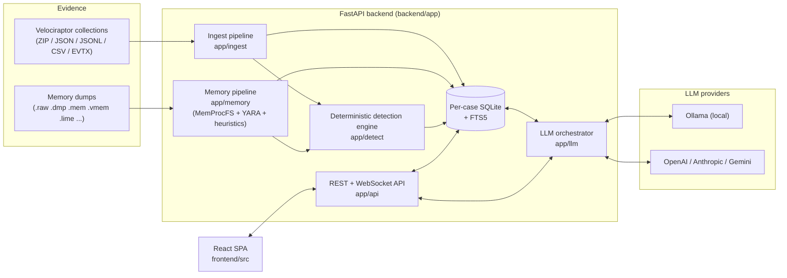
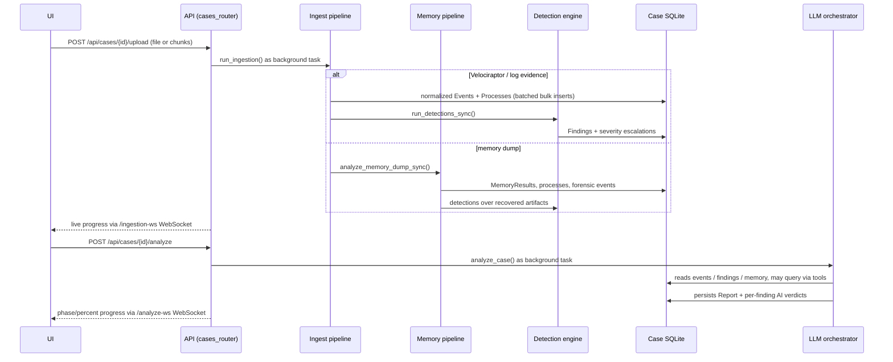

# Architecture

This document describes how Investigator is put together: the moving parts, how evidence flows through the system, where data lives, and how the AI layer is wired in. For install and usage instructions, see the [README](../README.md).

## Table of contents

- [System overview](#system-overview)
- [Repository layout](#repository-layout)
- [Evidence lifecycle](#evidence-lifecycle)
- [Backend](#backend)
  - [Entrypoint and serving model](#entrypoint-and-serving-model)
  - [Storage: case registry and per-case databases](#storage-case-registry-and-per-case-databases)
  - [Data model](#data-model)
  - [Ingestion (`app/ingest`)](#ingestion-appingest)
  - [Detection engine (`app/detect`)](#detection-engine-appdetect)
  - [Memory forensics (`app/memory`)](#memory-forensics-appmemory)
  - [AI layer (`app/llm`)](#ai-layer-appllm)
  - [API surface (`app/api`)](#api-surface-appapi)
- [Frontend](#frontend)
- [On-disk layout](#on-disk-layout)
- [Security model](#security-model)
- [Testing and CI](#testing-and-ci)

## System overview

Investigator is a local-first web application with two halves:

- A **Python backend** (FastAPI + SQLAlchemy) that owns all evidence parsing, detection, memory analysis, storage, and LLM orchestration.
- A **React frontend** (TypeScript + Vite) that is built to static files and served by the backend itself, so the whole app runs from a single process on `http://localhost:8400`.



Two design decisions shape everything else:

1. **Deterministic first, AI second.** Parsing, normalization, detection rules, and memory heuristics all run *before* any model is invoked, and their output is stored as plain rows. The LLM never produces the primary evidence — it summarizes, correlates, and gives verdicts over data that already exists and can be inspected directly in the UI.
2. **One SQLite database per case.** Each case is fully self-contained: its events, processes, findings, memory results, reports, and chat history live in a single file under `~/.investigator/cases/<case_id>/`. Deleting the directory deletes the case.

## Repository layout

```
Investigator/
├── run.py                # One-command launcher: venv, locked deps, frontend build, server
├── run.bat               # Windows double-click wrapper around run.py
├── backend/
│   ├── app/
│   │   ├── main.py       # FastAPI app, CORS, static frontend serving, /api/health
│   │   ├── config.py     # App config (~/.investigator/config.json) + keyring secrets
│   │   ├── api/          # HTTP + WebSocket routers
│   │   ├── ingest/       # Parsers, normalization, upload/ingestion pipeline
│   │   ├── detect/       # Detection rules, engine, process tree, entity graph, overrides
│   │   ├── memory/       # MemProcFS runner, YARA scanner, memory analysis pipeline
│   │   ├── llm/          # Provider abstraction, prompts, tool loop, orchestrator
│   │   ├── store/        # Case registry, per-case DB engines, SQLAlchemy models
│   │   └── models/       # Pydantic request/response schemas
│   ├── tests/            # Pytest suite
│   ├── scripts/          # Lock-file regeneration (uv pip compile)
│   └── requirements*.in / *.lock   # Human-edited deps + hashed locks
└── frontend/
    └── src/
        ├── pages/        # One React page per tab (Overview, Timeline, Memory, ...)
        ├── components/   # Shared UI (upload panel, ATT&CK matrix, dossier panel, ...)
        └── lib/          # API client, shared types, UI helpers
```

## Evidence lifecycle

The full path from an uploaded file to an AI-written report:



1. **Upload.** Files arrive whole (`/upload`) or in resumable chunks (`/upload-chunk`) and are stored under the case's `uploads/` directory.
2. **Ingest.** File type is detected by extension. Structured evidence is parsed and normalized into unified `Event` rows (plus `Process` rows where process listings or process-creation events are found); memory-dump extensions route to the memory pipeline instead. Inserts are batched (10k rows by default, tunable via `INVESTIGATOR_INGEST_BATCH_SIZE`) and mirrored into the FTS5 index.
3. **Detect.** The deterministic engine runs automatically after ingest, writing `Finding` rows and escalating the severity of implicated events/processes with a recorded `severity_reason` (provenance for *why* something is red).
4. **Analyze (on demand).** The LLM orchestrator produces the report, timeline narrative, and per-finding verdicts (see [AI layer](#ai-layer-appllm)).
5. **Explore.** Every UI surface — timeline, entity map, process dossiers, findings, event explorer, chat — reads the same case database through the REST API.

## Backend

### Entrypoint and serving model

`app/main.py` builds the FastAPI app:

- Binds to `127.0.0.1` only (port from `INVESTIGATOR_PORT`, default `8400`); this is a local tool, not a network service.
- CORS is restricted to the app's own origins (the served UI plus the Vite dev server on `:5173`).
- If `frontend/dist` exists it is mounted and served with an SPA fallback that resolves paths safely inside `dist` (no path traversal).
- Startup cleanup removes orphaned case directories and stale in-progress artifacts; shutdown disposes all cached DB engines.
- `/api/health` reports whether the optional MemProcFS and YARA capabilities are available, which the UI surfaces as health status.

### Storage: case registry and per-case databases

`app/store` has two layers:

- **Case registry** (`cases.py`): a small JSON registry (`~/.investigator/cases/registry.json`) mapping case IDs (8 hex chars) to name, description, status, and stats. It also owns case lifecycle: create/delete, orphan cleanup, and per-case session handout.
- **Per-case database** (`database.py`): each case gets its own SQLite file with a cached engine + sessionmaker. Connections are tuned for this workload: WAL journaling (readers keep working during long ingest writes), 30 s busy timeout, ~64 MiB page cache, in-memory temp store, and mmap for read-heavy stat/timeline queries. An `events_fts` FTS5 virtual table indexes event summary/entity/source/category for full-text search, used by both the UI event explorer and the LLM's `search_events` tool. `compact_db()` reclaims space (WAL checkpoint + VACUUM) after large evidence deletions.

Schema creation is idempotent, with a lightweight in-place migration path for columns added after a case DB was created.

### Data model

All tables live in the per-case database:

| Table | Purpose |
| --- | --- |
| `events` | The unified evidence row: timestamp, host, source, category, entity, severity (+ `severity_reason` provenance), one-line summary, and the full raw record as JSON. |
| `processes` | Process inventory from pslist-style artifacts, Sysmon EID 1 / Security 4688 events, and memory analysis; keyed by pid/ppid within a `session_id` (e.g. `live` vs. a memory dump session). |
| `findings` | Detection results — deterministic rules, memory heuristics, and AI-extracted findings — with severity, MITRE ATT&CK techniques, structured evidence, and an optional AI verdict. |
| `memory_results` | Per-plugin memory analysis output (process anomalies, YARA hits, drivers, network, ...) with severity and structured data. |
| `reports` | Generated AI reports: executive summary, timeline narrative, per-finding analysis. |
| `chat_history` | The case's AI chat transcript (also feeds the rolling conversation memo). |
| `case_meta` | Per-case key/value store: ingestion bookkeeping, chat memo, and user overrides (benign-marked findings, disabled rules) that must survive a findings rebuild. |

### Ingestion (`app/ingest`)

- **`parsers.py`** understands Velociraptor offline-collector ZIPs (walking members without full extraction), JSON, JSONL, CSV, and EVTX. Each parser yields raw rows tagged with their source artifact.
- **`normalize.py`** maps heterogeneous raw rows onto the unified `Event` shape — timestamp parsing, category assignment, entity extraction, one-line summaries — so that everything downstream (search, detection, timeline, LLM) works over one schema.
- **`pipeline.py`** drives an upload end to end: routes memory-dump extensions to the memory pipeline, streams parsed rows into batched bulk inserts, extracts `Process` rows from process listings and process-creation events (Sysmon EID 1, Security 4688 — including hex PID forms), reports progress through a callback that feeds the ingestion WebSocket, and triggers detections when done.
- **`evidence.py`** manages the uploaded files themselves: listing with ingestion stats, deletion together with all derived rows, and re-ingestion.

### Detection engine (`app/detect`)

Runs automatically after every ingest and can be re-run (`POST /{case_id}/detections/run`) after tuning.

- **`rules.py`** defines the rule corpus: LOLBin usage, suspicious parent/child process pairs, masquerading, execution from staging/user-writable paths, persistence mechanisms, log clearing, C2/beaconing indicators — each mapped to MITRE ATT&CK techniques.
- **`engine.py`** applies the rules over ingested events and processes. It contains dedicated analyzers for high-signal sources (USN-journal create/rename chains, double extensions, MemProcFS timeline entries, command lines wherever they appear) and writes `Finding` rows. When a finding implicates an event or process, the engine escalates that row's severity and records the reason, so the UI can always answer "why is this red?". Corroboration logic is idempotent — re-running detections does not double-escalate.
- **`process_tree.py`** builds the tree structures behind the process-map UI, per session (live vs. memory).
- **`entity_graph.py`** extracts actors (users, IPs, hosts, processes, services, accounts) and the labeled actions between them from all ingested evidence — the data behind the Entity Action Map and per-entity dossiers/investigations.
- **`overrides.py`** stores analyst overrides (mark-finding-benign, disable-rule) in `case_meta` rather than on findings, so they survive a full detections rebuild and are re-applied both at rule-evaluation time and at read time.

### Memory forensics (`app/memory`)

Raw memory dumps take a separate path (optional — requires `memprocfs`, and `yara-python` for scanning; without them the rest of the app still works and the UI shows the gap in health status):

- **`memprocfs_runner.py`** mounts the dump with MemProcFS and collects the analysis tables — processes, modules, VADs, threads, handles, network, services, drivers — plus forensic VFS artifacts (CSV timelines, event logs) copied into the case directory.
- **`forensics.py`** ingests those copied forensic artifacts into normalized case events, so memory-derived timeline data lands in the same `events` table as everything else.
- **`yara_scanner.py`** sweeps memory with the bundled ruleset (`yara_rules/apt_indicators.yar`: Cobalt Strike, Meterpreter, Sliver/Covenant/Havoc, Mimikatz, Rubeus, reflective loaders, shellcode markers) plus any user-supplied rules directory.
- **`pipeline.py`** runs the heuristics over the collected tables: injection and hollowing candidates, suspicious services, drivers, and network activity. Its grading philosophy is explicit: *a single anomalous view is a lead, not a verdict*. Severity scales with the number of independent corroborating artifacts (VAD shape, module load order, live thread start addresses, network context), the correlation basis is stored with each result, and anomaly classes that fire across a large fraction of all scanned processes are damped as machine-wide noise rather than escalated.
- **`explorer.py`** provides on-demand MemProcFS browsing after analysis: VFS listing/download, per-process module and handle views, and process-memory extraction, exposed through the memory API endpoints.

### AI layer (`app/llm`)

The AI layer is strictly downstream of deterministic analysis and is provider-agnostic.

**Providers** (`base.py`, `ollama.py`, `openai_provider.py`, `anthropic_provider.py`, `gemini_provider.py`): a minimal abstraction — each provider implements chat completion (plus streaming), model listing, and a connection test. Ollama discovers installed models live; remote providers use per-provider model catalogs. Selection, model, temperature, and max tokens come from `config.py`; API keys come from the OS keyring, never from disk.

**Tool loop** (`tools.py`): because providers only expose `complete(messages)`, tool use is *emulated* rather than delegated to provider-native function calling: the model must answer each turn with a single strict-JSON action (`{"tool": ..., "args": ...}` or `{"final": ...}`), and tool results are fed back as user messages, under a bounded iteration budget. The tools query the case database directly:

| Tool | What it returns |
| --- | --- |
| `search_events` | FTS5 full-text search over event summaries/entities |
| `filter_events` | Structured event filtering (severity, category, time, ...) |
| `count_events` | Aggregate counts for a query |
| `get_process` | A process with its parent/children, flags, and command line |
| `get_memory_results` | Memory analysis rows, optionally filtered |
| `get_findings` | Current findings with evidence |

This is what lets the model pull the actual log lines behind a claim before committing to it — during correlation, verdicts, entity investigation, and chat alike.

**Orchestrator** (`orchestrator.py` + `prompts.py`): `analyze_case()` is a map-reduce over the evidence, emitting phase/percent progress to the analysis WebSocket at each step:

1. **Map** — events are grouped by category and each of the largest categories is summarized independently (severity-prioritized within the batch).
2. **Reduce** — a tool-assisted correlation pass merges the category summaries, deterministic findings, and high-severity memory results into an attack narrative (falling back to a single-shot completion if the tool loop fails).
3. **Findings extraction** — structured, deduplicated AI findings are parsed out of the correlation and stored alongside deterministic ones (never allowed to fail the run).
4. **Report** — executive summary, then a timeline narrative over the key medium+ severity events.
5. **Verdicts** — the top findings by severity each get an individual verdict; the highest-priority ones may use the tool loop to check the evidence first.
6. **Persist** — the `Report` row is saved and the case status flips back to `ready`.

`chat_stream()` powers the retrieval-augmented case chat: it has the same tools, streams tokens over the chat WebSocket, saves the transcript, and maintains a compact rolling memo of long conversations so context truncation doesn't lose the investigation thread. `investigate_entity_stream()` does the same for on-demand per-entity investigations from the entity map.

### API surface (`app/api`)

Three routers; the UI's chunked upload keeps large evidence transfers resumable, and all long-running work (ingest, memory analysis, AI analysis) runs as background tasks with progress delivered over WebSockets.

| Router | Prefix | Responsibilities |
| --- | --- | --- |
| `cases_router` | `/api/cases` | Case CRUD; evidence upload (whole + chunked), listing, deletion, re-ingest; events (search/filter/timeline/categories); findings + benign/disable-rule overrides + detection re-run; ATT&CK matrix; process sessions/tree/detail; entities + dossiers; memory results, VFS browse/download/archive, per-process modules/handles/memory download. |
| `analysis_router` | `/api/cases` | Start AI analysis (`/analyze`, deduplicated per case), fetch reports and chat history. |
| `settings_router` | `/api/settings` | LLM provider/model config, live model listing, connection test, keyring key set/delete, general settings. |

WebSockets:

| Endpoint | Streams |
| --- | --- |
| `/api/cases/{id}/ingestion-ws` | Per-file ingestion / memory-analysis progress |
| `/api/cases/{id}/analyze-ws` | AI analysis phase, message, percent |
| `/api/cases/{id}/chat-ws` | Token-streamed chat with tool-call activity |
| `/api/cases/{id}/investigate-entity-ws` | Streamed per-entity AI investigation |

## Frontend

`frontend/src` is a React 18 + TypeScript SPA built with Vite and styled with Tailwind (dark, glassmorphic theme).

- **Routing**: React Router. `App.tsx` is the shell (header, nav); `pages/CasesPage.tsx` is the dashboard; `pages/CaseLayout.tsx` wraps the per-case tabs — Overview, Timeline, Entity Map, Memory, Findings, Events, Evidence, Report, AI Chat — plus `SettingsPage`.
- **Data layer**: `lib/api.ts` wraps the REST API and WebSocket endpoints; `lib/types.ts` mirrors the backend's Pydantic schemas; TanStack Query handles fetching, caching, and invalidation. In dev, Vite proxies `/api` to the backend.
- **Visualization**: React Flow renders the interactive process/entity maps, vis-timeline the zoomable timeline, Recharts the overview charts and ATT&CK heat map.
- **Live updates**: upload/ingestion progress, AI analysis phases, chat tokens, and entity investigations all arrive over the WebSocket endpoints listed above, so long-running work never blocks the UI.

## On-disk layout

Everything the app persists lives under the user's home directory:

```
~/.investigator/
├── config.json           # LLM provider/model settings (no secrets)
└── cases/
    ├── registry.json     # Case registry (id → name, status, stats)
    └── <case_id>/        # 8-hex-char case ID
        ├── case.db       # The per-case SQLite database (+ WAL files)
        ├── uploads/      # Original evidence files as uploaded
        └── memory artifacts, extracted forensic files, ...
```

API keys are **not** in any of these files — they are stored in the OS credential vault via `keyring` under the `investigator-dfir` service name.

## Security model

Investigator assumes it is handling sensitive forensic evidence on an analyst's machine:

- **Local only.** The server binds to `127.0.0.1`; CORS allows only the app's own origins. Nothing is exposed to the network.
- **Secrets in the keyring.** Provider API keys live in the OS credential vault, never in config files or the database.
- **Reproducible dependencies.** Python installs use hashed lock files (`pip --require-hashes`); the frontend installs with `npm ci` against the committed lock file. `--allow-unlocked-deps` exists only as a temporary local bootstrap. See [SECURITY.md](../SECURITY.md).
- **Safe static serving.** The SPA fallback resolves paths with `realpath` and refuses anything outside `frontend/dist`.
- **AI is advisory.** Model output is layered on top of inspectable deterministic data and is presented as leads for analyst review, not ground truth. The only data sent to a remote provider (if you configure one) is the case evidence excerpts the orchestrator and tools include in prompts; with Ollama, nothing leaves the machine.

## Testing and CI

- **Backend tests** (`backend/tests/`, `unittest`) cover the API read paths, bulk event ingestion, the case store, detection-rule accuracy against a command-line corpus, finding overrides, severity propagation, memory explorer/runner/forensics, USN provenance, and normalization equivalence. Run them with `python -m unittest discover -s tests` from `backend/`.
- **CI** (`.github/workflows/ci.yml`) runs the backend on Python 3.11 with locked dependencies — compile check, Ruff lint, the test suite, and `pip-audit` — and type-checks/builds the frontend with `npm ci` + `npm audit`. Pull requests additionally get a dependency review, and CodeQL scanning runs from `codeql.yml`. Dependabot keeps the lock inputs current.
