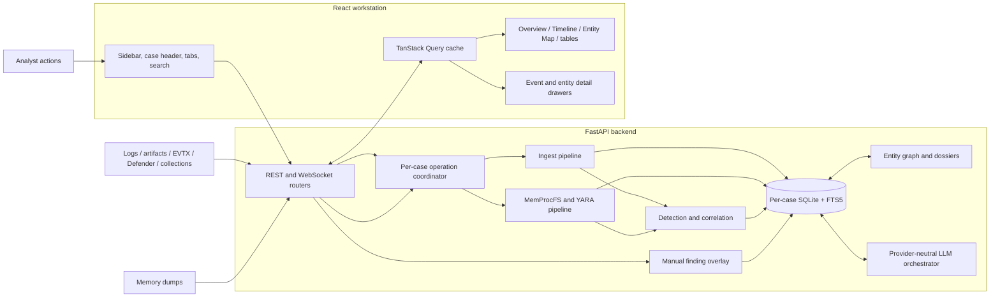
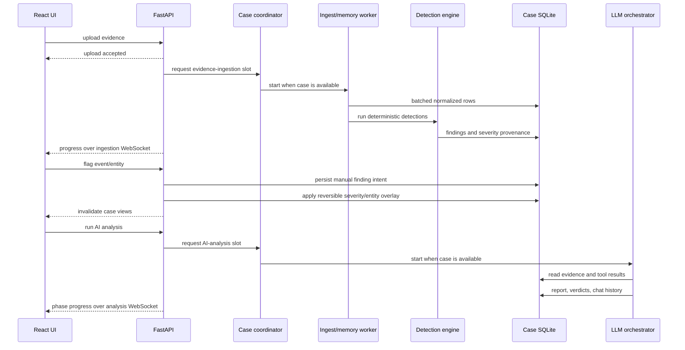

# Investigator Architecture

This document describes the current Investigator architecture: runtime ownership,
evidence flow, UI composition, concurrency rules, storage semantics, visualization
pipelines, and the invariants contributors must preserve. Installation and daily
usage are covered in the [README](../README.md); security reporting is covered in
[SECURITY.md](../SECURITY.md).

## Contents

- [Architecture goals](#architecture-goals)
- [Migration summary](#migration-summary)
- [System overview](#system-overview)
- [Repository layout](#repository-layout)
- [Evidence and analysis lifecycle](#evidence-and-analysis-lifecycle)
- [Backend architecture](#backend-architecture)
  - [Serving model](#serving-model)
  - [Case registry and storage](#case-registry-and-storage)
  - [SQLite concurrency](#sqlite-concurrency)
  - [Long-running operation coordination](#long-running-operation-coordination)
  - [Ingestion and memory analysis](#ingestion-and-memory-analysis)
  - [Detection and analyst findings](#detection-and-analyst-findings)
  - [Entity graph and dossiers](#entity-graph-and-dossiers)
  - [AI orchestration](#ai-orchestration)
  - [API and WebSockets](#api-and-websockets)
- [Frontend architecture](#frontend-architecture)
  - [Application shell and routing](#application-shell-and-routing)
  - [Theme and design tokens](#theme-and-design-tokens)
  - [Data and state boundaries](#data-and-state-boundaries)
  - [Timeline rendering pipeline](#timeline-rendering-pipeline)
  - [Entity Map rendering pipeline](#entity-map-rendering-pipeline)
  - [Drawers, modals, and interaction contracts](#drawers-modals-and-interaction-contracts)
  - [Asynchronous UX and performance](#asynchronous-ux-and-performance)
- [Data model](#data-model)
- [Consistency and security invariants](#consistency-and-security-invariants)
- [Testing and change checklist](#testing-and-change-checklist)

## Architecture goals

Investigator is a local-first DFIR workstation. Its architecture follows these
principles:

1. **Deterministic evidence first.** Parsing, normalization, memory analysis,
   detection, correlation, and analyst overrides produce inspectable database
   state. AI is downstream and advisory.
2. **One case, one database.** Each case owns a SQLite database and evidence
   directory. Queries, caches, background jobs, and transient frontend state are
   keyed by case ID.
3. **Readable during work.** Long writes are serialized, but SQLite WAL permits
   concurrent readers. The UI shows busy state and progress instead of freezing.
4. **Analyst intent is reversible.** Marking an event or entity as a finding does
   not destroy parser/detector provenance. Prior event severity is restored when
   the manual finding is removed or suppressed.
5. **Visualizations are derived views.** Timeline and Entity Map are built from
   normalized rows and can be rebuilt without changing source evidence.
6. **Exact identity beats convenient matching.** Full file/process paths are
   normalized and matched exactly. Basename fallback is used only when the source
   identity is basename-only and unambiguous.

## Migration summary

The current architecture replaces the earlier UI/runtime behavior while preserving
case route paths and the per-case database model.

| Earlier behavior | Current architecture |
| --- | --- |
| Header-centered navigation and a separate Dashboard entry | Persistent responsive sidebar plus case-scoped Dashboard/overview and segmented case tabs |
| Dark-only visual assumptions | Semantic CSS tokens with persisted system/light/dark theme selection |
| Search occupied permanent header space or navigated away | Expandable current-case search with inline results and double-click detail drawer |
| Visualization dependencies in the initial bundle | Timeline and Entity Map loaded as lazy route chunks |
| Timeline exposed intermediate vis-timeline geometry | Timeline stays hidden until its imperative layout reports ready |
| Timeline filters and facets shared one query lifecycle | Stable case-wide facet query plus abortable server-filtered event query |
| Entity nodes stacked in fixed columns | Deterministic semantic layers with severity ranking and barycenter crossing reduction |
| Entity click mixed selection and expansion | Single-click dossier; explicit Focus action; double-click one-hop expand/compact |
| Background workflows could overlap by case | Per-case async coordinator for ingestion, analysis, rebuild, and deletion |
| SQLite busy timeout was the main writer protection | WAL plus a process-local per-database writer transaction gate |
| Manual findings existed mainly as finding rows | Durable analyst intent with node derivation, exact-path correlation, and reversible event severity |
| Entity dossier construction could block an async WebSocket | Synchronous graph/dossier work dispatched through `asyncio.to_thread()` |
| Previous query data could briefly cross case routes | Query placeholders and transient UI state explicitly constrained by case ID |

## System overview



The production frontend is built into `frontend/dist` and served by FastAPI, so
the normal deployment is one local process on `127.0.0.1:8400`. Development mode
uses Vite on `:5173` with `/api` proxied to the backend.

## Repository layout

```text
Investigator/
|-- run.py                         launcher and dependency/build orchestration
|-- run.bat                        Windows launcher wrapper
|-- README.md                      user and contributor entry point
|-- SECURITY.md                    security and sensitive-data policy
|-- docs/
|   `-- ARCHITECTURE.md            this document
|-- backend/
|   |-- app/
|   |   |-- main.py                FastAPI setup and static SPA serving
|   |   |-- api/                   REST and WebSocket routers
|   |   |-- ingest/                parsers, normalization, evidence lifecycle
|   |   |-- memory/                MemProcFS, YARA, forensic extraction
|   |   |-- detect/                rules, overrides, manual findings, graphs
|   |   |-- llm/                   providers, tools, prompts, orchestration
|   |   |-- store/                 registry, operation locks, SQLAlchemy storage
|   |   `-- models/                request/response schemas
|   `-- tests/                     unittest regression suite
`-- frontend/
    |-- src/
    |   |-- App.tsx                global workstation shell and case search
    |   |-- main.tsx               router, query client, lazy route boundaries
    |   |-- index.css              theme tokens and shared visual behavior
    |   |-- components/            panels, drawers, upload, analysis, flagging
    |   |-- lib/                   API client, types, theme provider, UI helpers
    |   `-- pages/                 case and settings routes
    `-- dist/                      production build served by FastAPI
```

## Evidence and analysis lifecycle



Important lifecycle behavior:

- Ingestion and memory analysis run outside the request/response lifetime.
- The operation coordinator queues mutually exclusive work for the same case.
- After a queued job acquires its slot, it rechecks that the case still exists.
  This prevents a delayed job from recreating a deleted case database.
- Upload and analysis progress are pushed to the UI. Completion invalidates all
  case-scoped views that can be affected by newly derived data.
- The case remains readable during long operations. Editing controls that would
  conflict with the current operation are disabled or queued with visible state.

## Backend architecture

### Serving model

`backend/app/main.py` owns the FastAPI application:

- binds to loopback by default;
- restricts CORS to the application and Vite development origins;
- serves `frontend/dist` with an SPA fallback when a production build exists;
- exposes health information for optional memory/YARA capabilities;
- performs startup cleanup of stale/orphaned case artifacts; and
- disposes cached SQLAlchemy engines at shutdown.

Blocking or CPU-heavy work must not execute directly on the asyncio event loop.
The ingest and analysis pipelines use executors/threads, and entity dossier
construction invoked from an async WebSocket uses `asyncio.to_thread()`.

### Case registry and storage

`app/store/cases.py` owns the registry and case lifecycle. The registry is a JSON
document under `~/.investigator/cases/registry.json` containing display metadata,
status, timestamps, and case IDs. Case IDs are validated before filesystem access.

Each case directory contains:

```text
~/.investigator/cases/<case_id>/
|-- case.db                         SQLAlchemy/SQLite database
|-- case.db-wal / case.db-shm       SQLite WAL state while active
|-- uploads/                        original uploaded evidence
`-- memory/extracted artifacts      source-dependent derived files
```

Registry writes are serialized and persisted atomically. Deletion disposes the
cached database engine before removing the directory. Single-event detail and
manual-finding mutation routes verify registry membership before opening a session,
and queued background jobs recheck membership before doing work.

### SQLite concurrency

SQLite supports concurrent readers in WAL mode but only one writer. Investigator
uses two complementary controls in `app/store/database.py`:

1. **SQLite configuration:** WAL journaling, a 30-second busy timeout, page cache,
   in-memory temporary storage, and mmap for read-heavy queries.
2. **Per-database writer gate:** every session is a `SerializedWriteSession` with
   an `RLock` shared by all sessions for that database path. It acquires the lock
   before the first flush/DML statement and holds it through commit, rollback, or
   close.

Read-modify-write metadata operations must call
`acquire_session_write_lock(session)` *before the read*. Locking only at flush is
too late for JSON metadata such as manual findings and benign/disabled-rule sets:
two sessions could both read the old value and one update would be lost even if
SQLite never raised `database is locked`.

The writer gate is process-local. Investigator is designed to run as one backend
process; launching multiple independent backend processes against the same case
directory is not a supported deployment model.

### Long-running operation coordination

`app/store/operations.py` provides a `CaseOperationCoordinator` keyed by case ID.
It serializes operations whose side effects must not overlap:

- evidence ingestion and memory analysis;
- AI analysis;
- detection rebuilds; and
- case deletion.

The coordinator tracks the active operation and queue depth for status messages.
It is an asyncio coordination layer, distinct from the SQLite writer gate:

- the coordinator protects high-level workflows and filesystem/database lifetime;
- the writer gate protects individual database transactions; and
- WAL preserves read availability while a writer is active.

Do not replace one layer with the other. A workflow may perform several commits,
touch uploaded files, or invoke external tools, while a transaction lock covers
only one database transaction.

### Ingestion and memory analysis

`app/ingest` accepts ZIP collections (e.g. Velociraptor), JSON, JSONL, CSV, EVTX/event
logs, and Microsoft Defender / Azure (Sentinel) log exports.

- `parsers.py` streams source rows without requiring complete archive extraction.
- `normalize.py` maps source-specific fields into the shared `Event` schema.
- `pipeline.py` batches event inserts, synchronizes FTS rows, extracts process
  inventory where available, reports progress, and invokes detections.
- `evidence.py` owns uploaded-file listing, deletion, and re-ingestion semantics.

Memory images route through `app/memory`:

- MemProcFS collection provides process/module/VAD/thread/handle/network/service
  and driver views;
- forensic CSV and EVTX outputs are normalized into the same `events` table;
- YARA scans bundled and optional user rules; and
- correlation requires multiple independent artifacts before escalation where
  possible, reducing machine-wide or tooling-related noise.

### Detection and analyst findings

`app/detect/engine.py` runs deterministic rules and stores both conclusions and
provenance. Event severity is accompanied by `severity_reason`, allowing every
timeline/detail surface to explain whether severity came from parsing, a detection,
context, flagged-entity propagation, or analyst action.

`app/detect/overrides.py` persists disabled rules and benign finding identities in
`case_meta`. These overrides survive a findings-table rebuild and are applied after
detector output is materialized.

`app/detect/manual.py` implements durable analyst-created findings:

- intent is stored as JSON in `case_meta`, then materialized as `Finding` rows;
- entity flags carry explicit type/value information;
- event flags derive an entity from raw evidence, including EvidenceOfDownload
  `DownloadedFilePath`, common file/process fields, host, user, and IP fields;
- Windows device prefixes such as `\\.\C:\...` are normalized;
- the referenced event and events mentioning the same exact full path/entity can
  inherit the manual severity;
- prior event severity and reason are stored separately as a reversible baseline;
- benign/delete restores the baseline, while restore/un-benign reapplies intent;
- a detection rebuild restores manual baselines before recalculation and reapplies
  active manual findings afterward; and
- legacy findings without derived node metadata are repaired lazily when Events,
  Timeline, or Entity Map next reads the case.

Full paths never correlate solely because another path shares the same basename.
When only a basename is available, fallback is allowed only for an unambiguous
same-type node. This identity rule is shared by event impact and graph correlation.

### Entity graph and dossiers

`app/detect/entity_graph.py` derives a graph from Events, Processes, and Findings,
including process/event rows normalized from memory artifacts. Node types include
user, account, host, IP, process, service, file, URL, registry, and domain. Edges
record an action verb, count, severity, timestamps, and representative samples.

Graph construction behavior:

- event actors are extracted through shared source-field mappings;
- manual-node event candidates are indexed in one pass rather than scanning the
  complete event list once per manual finding;
- full-path process/file identity uses normalized exact matching;
- high-risk edges can be animated by the frontend, but animation is presentation
  only and does not change graph data;
- graph results are cached by case/query parameters and a case DB/WAL fingerprint;
- builds for one case are serialized to avoid duplicate expensive work; and
- `max_nodes` caps the response while preserving severity/activity ranking.

An entity dossier rebuilds the relevant graph context and returns chronological
actions, neighbors, findings, and metadata. AI entity investigation uses this
dossier and runs its synchronous construction off the asyncio event loop.

### AI orchestration

`app/llm` is provider-neutral. Ollama stays local; OpenAI, Anthropic, and Gemini
send only prompt/tool excerpts to the configured provider. API keys live in the OS
credential vault.

The tool loop exposes bounded database operations such as event search/filtering,
counts, process lookup, memory results, and findings. `analyze_case()` performs a
map/reduce-style workflow over event categories, deterministic findings, and memory
signals, then writes a report, timeline narrative, and finding verdicts.

Chat and entity investigation stream over WebSockets. Chat history is persisted and
older turns are compacted into a rolling memo. Model output remains advisory and
never replaces raw evidence.

### API and WebSockets

| Router | Main responsibilities |
| --- | --- |
| `cases_router` | Case CRUD, uploads, evidence, events, timeline/facets, findings, manual findings, detection rebuild, ATT&CK matrix, entity graph/dossiers, process and memory exploration. |
| `analysis_router` | AI analysis start/progress, reports, chat history/streaming, entity investigation streaming. |
| `settings_router` | Provider/model configuration, keyring operations, model discovery/testing, general settings. |

| WebSocket | Purpose |
| --- | --- |
| `/api/cases/{id}/ingestion-ws` | Ingestion and memory-analysis phase/progress/error state. |
| `/api/cases/{id}/analyze-ws` | AI analysis queue/phase/progress/completion. |
| `/api/cases/{id}/chat-ws` | Tool activity and streamed chat output. |
| `/api/cases/{id}/investigate-entity-ws` | Streamed investigation of one entity dossier. |

REST reads remain available while long operations run. Mutations validate case
existence and long operations recheck after waiting for their coordinator slot.

## Frontend architecture

### Application shell and routing

`frontend/src/main.tsx` creates the browser router and provider hierarchy:

```text
React.StrictMode
`-- ThemeProvider
    `-- QueryClientProvider
        `-- RouterProvider
```

`App.tsx` is the global workstation shell:

- persistent responsive left sidebar (Cases and Settings);
- compact mobile header;
- light/dark toggle;
- expandable current-case event search with inline results; and
- top-level event detail drawer.

`CaseLayout.tsx` owns case-scoped chrome:

- reusable case identity/status hero;
- active/suppressed finding verdict banner;
- segmented case-tab navigation;
- upload and analysis actions; and
- a visible busy-state banner while ingestion or analysis is active.

The Dashboard is the case `overview` route rather than a separate global product
area. Existing route paths remain stable:

```text
/
/settings
/cases/:caseId/{overview,timeline,findings,evidence,entities,memory,events,report,chat}
```

Timeline and Entity Map are lazy imports because vis-timeline and React Flow are
the largest route dependencies. The initial case list, settings, and dashboard do
not pay their download/parse cost.

### Theme and design tokens

`lib/theme.tsx` supports `system`, `light`, and `dark` choices. The choice is stored
under `localStorage["investigator.theme"]`; system mode follows
`prefers-color-scheme`. The resolved theme is applied as `data-theme` and
`color-scheme` on the document root.

`index.css` defines semantic CSS variables for base/background surfaces, panels,
text, borders, shadow, accents, severity colors, and graph colors. Components use
tokens instead of hard-coded theme colors. The dark palette is neutral black/white
with restrained purple and blue accents rather than a single dark-blue wash.

Shared visual primitives live in `components/common.tsx`: surfaces, cards, icon
buttons, severity badges, loading/empty states, code blocks, and detail drawers.
Animations are short and productivity-focused: entrance opacity, hover elevation,
button press scale, progress transitions, and visualization readiness fades.

### Data and state boundaries

`lib/api.ts` is the typed fetch boundary. TanStack Query owns server state; local
component state owns transient controls such as open menus, selected rows, zoom,
and focus expansion.

Query conventions:

- case data keys place case ID immediately after the resource name, for example
  `['events', caseId, ...filters]` and `['entities', caseId, maxNodes]`;
- request `AbortSignal`s are forwarded to `fetch` where supported;
- previous data may be retained only when the previous query belongs to the same
  case; and
- route changes reset search, selected event/entity, filters, focus, and rendered
  graph state to prevent cross-case disclosure or misleading stale UI.

Mutation success invalidates all affected projections, not only the page where the
mutation originated. Upload completion invalidates case stats, evidence, events,
timeline data/facets, findings, entities/dossiers, ATT&CK, and memory views. Manual
finding changes additionally invalidate event details and global case search.

The global search is not navigation. It searches current-case events in place,
shows a bounded result list under the expandable field, and opens event detail only
on double-click.

### Timeline rendering pipeline

Timeline has a server-query layer and an imperative visualization layer:

1. A case-wide facet query fetches source/category counts and total timestamped
   events. It has a separate cache key from rapidly changing filters.
2. A filtered timeline query sends debounced text, minimum severity, enabled
   sources/categories, and a response cap to the backend.
3. Facet membership participates in the filtered query identity when exclusions
   are active, so a newly ingested source cannot leave stale filtered results.
4. Events are converted into vis-timeline `DataSet` instances only after the DOM
   container exists.
5. The canvas remains hidden behind an "Arranging timeline" state until the
   timeline emits `changed` (with a short fallback timeout), preventing the initial
   stacked/unpositioned flash.

The left rail aggregates the currently loaded events by year, month, and event type
with counts at each level. The toolbar provides search and server-side severity,
source, and category filters. Zoom controls act on the vis-timeline instance.

Hover tooltips are intentionally disabled. Double-clicking an actual event opens a
themed detail drawer and fetches the full raw event by ID. Timeline content inserted
into vis-timeline is HTML-escaped before rendering.

### Entity Map rendering pipeline

The backend returns graph semantics; the frontend owns deterministic layout and
interaction.

1. The normal view requests up to 250 ranked nodes; focus mode can request up to
   600 to reveal additional one-hop relationships.
2. Type, severity, and terminated-state filters are applied locally for immediate
   response.
3. `useDeferredValue`, `requestAnimationFrame`, and a React transition keep layout
   work from blocking urgent controls.
4. Nodes are assigned semantic columns:
   external/file/IP/domain/URL -> identity/host -> process -> service/registry.
5. Each column is initially ranked by severity, findings, activity, and label.
6. Alternating barycenter passes align connected neighbors and reduce crossings.
7. Stable row/column spacing and explicit left/right handles feed smooth-step edge
   routing. React Flow renders only visible elements and includes controls/minimap.
8. The map fades in after layout and then uses animated `fitView`.

Interaction is deliberately split:

- single-click selects a node and opens the entity dossier drawer;
- the dossier's Focus action enters focus mode;
- double-click on a connected node expands or compacts that node's one-hop links;
- closing the dossier does not implicitly change graph expansion; and
- switching cases clears selection, focus, expansion, filters, and rendered nodes.

### Drawers, modals, and interaction contracts

Event and entity details use the shared `DetailDrawer` primitive. Drawers render at
the application overlay layer, above shell controls, with their own scroll region
and a local backdrop/backdrop-filter. This prevents close buttons from colliding
with the theme toggle and blurs only content behind the active overlay.

Dialogs such as New Case and Upload Evidence use the shared modal backdrop/panel
tokens. Backdrops cover the full viewport and use theme-aware opacity plus strong
blur. Buttons use consistent hover, focus-visible, disabled, and active/pressed
states. Icon-only controls require accessible labels/tooltips.

### Asynchronous UX and performance

- WebSockets deliver ingestion, analysis, chat, and entity-investigation progress.
- Upload and analysis buttons disable when the case status is incompatible.
- Case status is polled while the case shell is mounted, preserving readability
  while exposing the active operation.
- Query requests use abort signals, and case switches clear stale transient state.
- Entity investigation moves blocking dossier construction to a worker thread.
- Timeline and Entity Map avoid showing unarranged intermediate geometry.
- Visualization route splitting keeps the initial bundle smaller.

## Data model

Every case database contains:

| Table | Ownership and purpose |
| --- | --- |
| `events` | Normalized evidence: timestamp, source, category, host/entity, effective severity, severity provenance, summary, raw JSON. |
| `processes` | Live and memory process inventory with PID/PPID, path, command line, session, flags, severity, and source-specific extras. |
| `findings` | Materialized detector, memory, AI, and manual findings with MITRE techniques, structured evidence, suppression state, and optional AI verdict. |
| `memory_results` | Structured outputs from memory plugins and correlation heuristics. |
| `reports` | Persisted executive summary, timeline narrative, and per-finding analysis. |
| `chat_history` | Case-scoped user/assistant transcript. |
| `case_meta` | Durable metadata: manual finding intent, manual event baselines/sync signature, disabled rules, benign identities, chat memo, and bookkeeping. |
| `events_fts` | FTS5 projection of event summary/entity/source/category used by search and LLM tools. |

`events.severity` is the current effective severity. `events.severity_reason` is
required provenance. Manual-event baseline metadata preserves the value that must
be restored when analyst intent no longer applies.

## Consistency and security invariants

Contributors must preserve these invariants:

1. New externally reachable case routes must validate registry membership before
   opening a database; existing read routes must not be copied as validation
   examples without checking their behavior.
2. A queued background job must recheck case existence after acquiring its case
   operation slot.
3. Per-case long operations that mutate shared case state must use the operation
   coordinator.
4. Every database write uses `SerializedWriteSession`; metadata read-modify-write
   code acquires the writer gate before reading.
5. Sessions release the writer gate on commit, rollback, and close, including
   exception paths.
6. Full-path correlations use normalized exact paths. Basename-only matching must
   not merge ambiguous paths.
7. Manual findings remain reversible across add, benign, restore, delete, and
   detection rebuild.
8. Frontend query/state reuse never crosses a case ID boundary.
9. Raw strings rendered as visualization HTML are escaped.
10. Remote LLM use is explicit; secrets stay in the OS keyring and real evidence
    is never committed to the repository.

## Testing and change checklist

Backend tests use `unittest` and cover parsing, bulk ingest, API reads, case
lifecycle, concurrency, detections, severity propagation, manual findings,
overrides, entity correlation, memory analysis, and source-specific provenance.

Frontend acceptance currently uses TypeScript compilation plus a production build;
there is no dedicated frontend test runner yet.

Before merging architecture-affecting changes:

```powershell
# backend
cd backend
python -m unittest discover -s tests

# frontend
cd frontend
npm run build
```

Also verify manually:

- light, dark, and system theme resolution;
- desktop, tablet, and mobile shell behavior;
- current-case search and double-click event details;
- timeline loading, filters, rail counts, zoom, and event drawer;
- Entity Map layout, filters, focus, single/double-click semantics, controls, and
  dossier overlay;
- upload/analysis busy state and completion invalidation;
- manual event/entity flag, benign/restore/delete, exact-path related events, and
  detection rebuild behavior; and
- switching between cases without stale search results, drawers, filters, graph,
  or timeline content.

CI additionally performs linting, dependency audits/review, frontend type/build
checks, and CodeQL analysis as configured under `.github/workflows/`.
